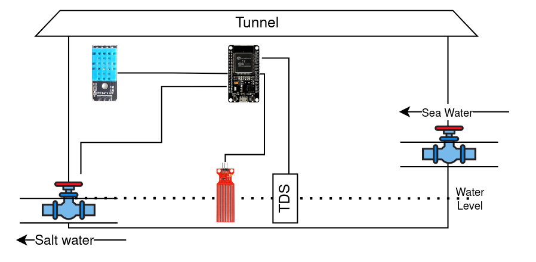

# Garam IOT Device

This device is designed to automate sea salt production.

## Device Description

Sea salt is made using several tunnels. Seawater is channeled into the tunnels. Each tunnel serves as a place for the evaporation of seawater. When the combination of salt and water levels reaches a certain amount, the seawater is channeled to the next tunnel.

### Device Illustration

Here illustration of how device will be installed.



Except for first tunnel, device will only control output water stream. Salinity and water level sensor will be installed on the surface of the water with the position of some part under water water level but not completely submerged. Temperature and humidy sensor will be installed above water level. Electic solenoid valve will be controlled by relay.

### Port

Please note that when using ESP32, some port is not available when wifi is active.

| Component           | Description                   |  Port |
|-------------------  |:------------------------------|------:|
| ESP32               | Microcontroller               | -     |
| Water Level Sensor  | Random Water Level Sensor     |    35 |
| DHT 11              | Temperature - Humidity Sensor |    26 |
| Relay               | 1ch Relay                     |    27 |
| Salinity Sensor     | TDS Sensor                    |    34 |

### Algorithm / Logic

```py
tds_param   = value to open gate
water_param = value to close gate

while true Then:
    cur_temp = measurement from temperature device
    cur_hum = measurement from humidity device
    cur_tds = measurement from salinity sensor
    cur_water = measurement from water level sensor

    if(cur_tds <= tds_param and cur_water <= water_param) Then:
        set relay to 1 #open valve
        sleep
        set relay to 0 #close valve

    # optional
    data = {cur_temp, cur_hum, cur_tds, cur_water}
    send data to backend

    commands = get command from backend
    if commands exist Then:
        run commands
    sleep

```

## How To Use

### Flash ESP 32 with micropython firmware

1. Download esp32 firmware from [here](https://micropython.org/download/esp32/)
2. Install esptool

```bash
pip install esptool setuptools
```

3. Flash firmware
   Port can be find in /dev (ubuntu) or device manager (windows)
   Note: For linux user, if error could not open , the port doesn't exist, please run sudo chmod a+rw /dev/ttyUSB0

```bash
python -m esptool --chip esp32 erase_flash
python -m esptool --chip esp32 --port <serial_port> write_flash -z 0x1000 <esp32-X.bin>
```

### Deploy Code to ESP32

1. Edit Config

```python
# Wifi Parameters
WIFI_ID = ''
WIFI_PASSWORD = ''

# XML RPC P/arameters
RPC_URL = ""
RPC_DB = ""
RPC_USER = ""
RPC_PASS = ""

# Pin Parameter
RELAY_PIN = 27
WATER_PIN = 35
TDS_PIN = 34
DHT_PIN = 26

# Other Parameters
DELAY = 10
TDS_PARAM = 
WATER_PARAM = 
OPEN_TIME = 100
SLEEP_TIME = 10
```

2. Compile and Insert src folder to esp32

## Emulator
I also create emulator to simulate esp32 behaviour when interacting with backend through api. This emulator simulate how microcontroller process comaand and send log to backend.
To run this emulator, simply tun emulator/sandbox.py

1. Configure simulation
You can configure sensor result in `emulator/sensor_sandbox.py`. What you need is change vaue in randrange to something appropriate.
``` python
sensor = random.randrange(min_value, max_value)
```

2. Run sandbox emulator
``` bash
python sandbox.py
```